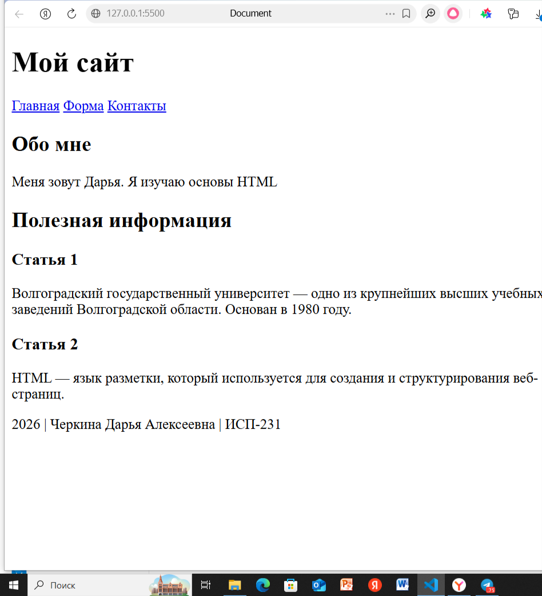

## Лабораторная работа №5. Введение в HTML
**ФИО:** Черкина Дарья Алексеевна
**Группа:** ИСП-231
**Дата:** 30.01.2026
#### Описание работы:
В данной лабораторной работе создаётся проект для изучения основ HTML.
Вы настраиваете рабочую директорию, создаёте базовые файлы, подключаете Git и GitHub, а также
подготавливаете HTML-файл для последующего изучения структуры веб-страницы.
#### Структура проекта
* **index.html** — основной HTML-файл
* README.md — описание лабораторной работы
* **img/** — скриншоты

---
### Теги в HTML
структура парного тега:
**<тег>тело</тег>**

*~Пример:~*
```
<h1>Это заголовок</h1>
```

## Базовые HTML-теги
#### Примеры:
```
<h2>Заголовок</h2>
<p>Абзац текста</p>
<strong>Жирный</strong>
<em>Курсив</em>
<hr>
<a href="https://example.com">Ссылка</a>

```

## Лабораторная работа №5. Введение в HTML

**ФИО:** Черкина Дарья Алексеевна
**Группа:** ИСП-231
**Дата:** 30.01.2026
#### Описание
В данной лабораторной работе создаётся проект для изучения основ HTML.
Вы настраиваете рабочую директорию, создаёте базовые файлы, подключаете Git и GitHub, а также
подготавливаете HTML-файл для последующего изучения структуры веб-страницы.

**Что изучили:**
* Создание и структурирование HTML-документа
* Использование базовых тегов
* Работа со списками
* Добавление атрибутов к тегам
* Создание таблиц
* Построение форм
* Семантическая разметка HTML5
* Отладка кода в браузере
* Валидация HTML-кода
#### Структура проекта

* about.html  —  Страница "Обо мне"
* webpageCard.html  —  "Веб-визитка"
* index.html — основной HTML-файл с практическими заданиями
* README.md — описание лабораторной работы
* img/ — скрины процесса работы

#### Теги и элементов
#### Текстовые элементы
<p>Абзац текста.</p>
<strong>Жирный текст</strong>
<em>Курсивный текст</em>
<br> 
<hr>

#### Ссылки и изображения
<a href="https://yandex.ru/images/search?from=tabbar&img_url=http%3A%2F%2Fcs15.pikabu.ru%2Favatars%2F9515%2Fx9515803-729970331.png&isize=small&lr=10951&ogl_url=http%3A%2F%2Fcs15.pikabu.ru%2Favatars%2F9515%2Fx9515803-729970331.png&p=3&pos=22&rlt_url=https%3A%2F%2Favatars.dzeninfra.ru%2Fget-zen_doc%2F9795216%2Fpub_6441d0d782601931c5d82bb2_6441d18d8ac641604918442e%2Fscale_1200&rpt=simage&text=мем%20">Ссылка</a>

#### Списки
<ol>
        <li>Пункт 1</li>
        <li>Пункт 2</li>
        <li>Пункт 3</li>
    </ol>
    <ul>
        <li>Пункт 1</li>
        <li>Пункт 2</li>
    </ul>

    <ul>
        <li>Пункт 1
            <ol>
                <li>Вложенный 1</li>
                <li>Вложенный 2</li>
            </ol>
        </li>
    </ul>


#### Таблицы

    <table border="1">
        <tr>
            <th>ИМя</th>
            <th>Возраст</th>
        </tr>
        <tr>
            <td>Алексей</td>
            <td>21</td>
        </tr>
        <tr>
            <td>Мария</td>
            <td>19</td>
        </tr>

#### Формы
<form>
  <label for="name">Имя:</label>
  <input type="text" id="name" placeholder="Введите имя">
  <button type="submit">Отправить</button>
</form>

#### Семантические теги
```
<header>шапка сайта или раздела</header>
<nav>навигация по сайту</nav>
<main>основное содержание страницы</main>
<section>логический раздел</section>
<article>самостоятельный блок контента</article>
<footer>подвал сайта</footer>
```

